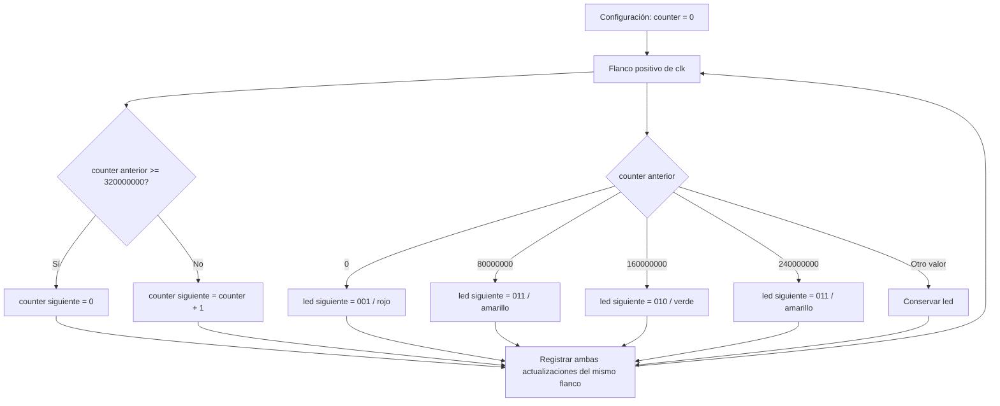
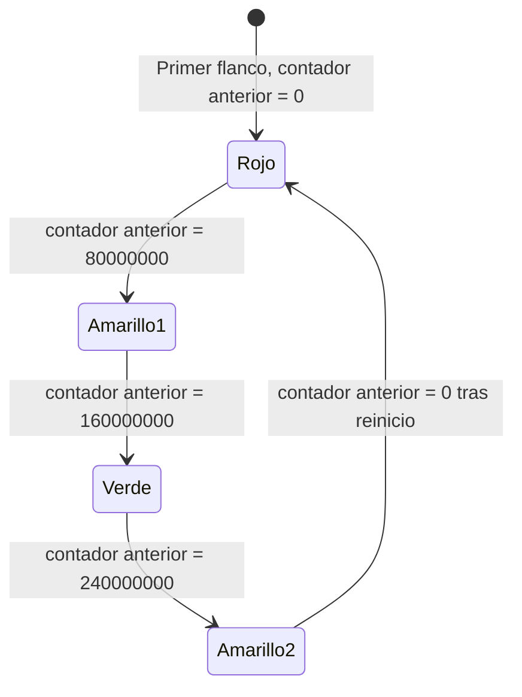
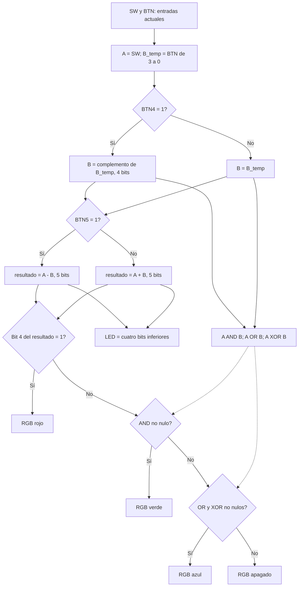
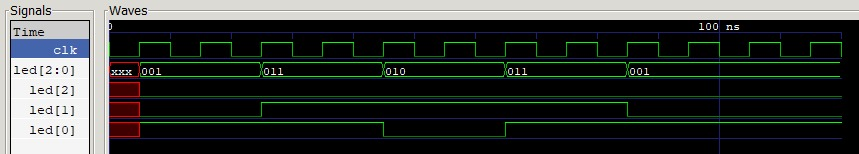
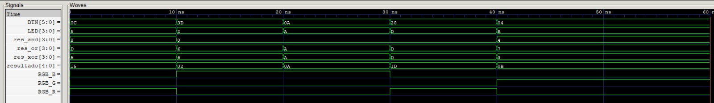
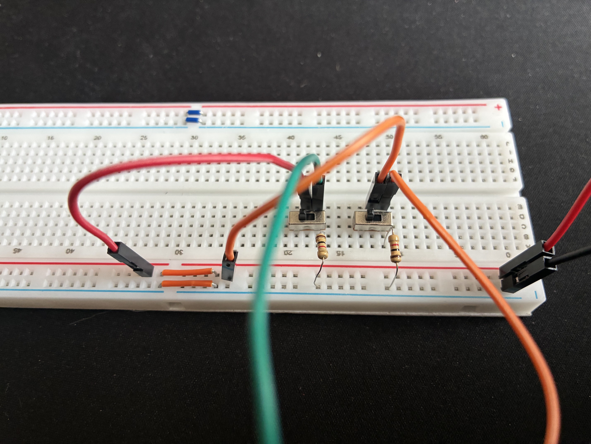
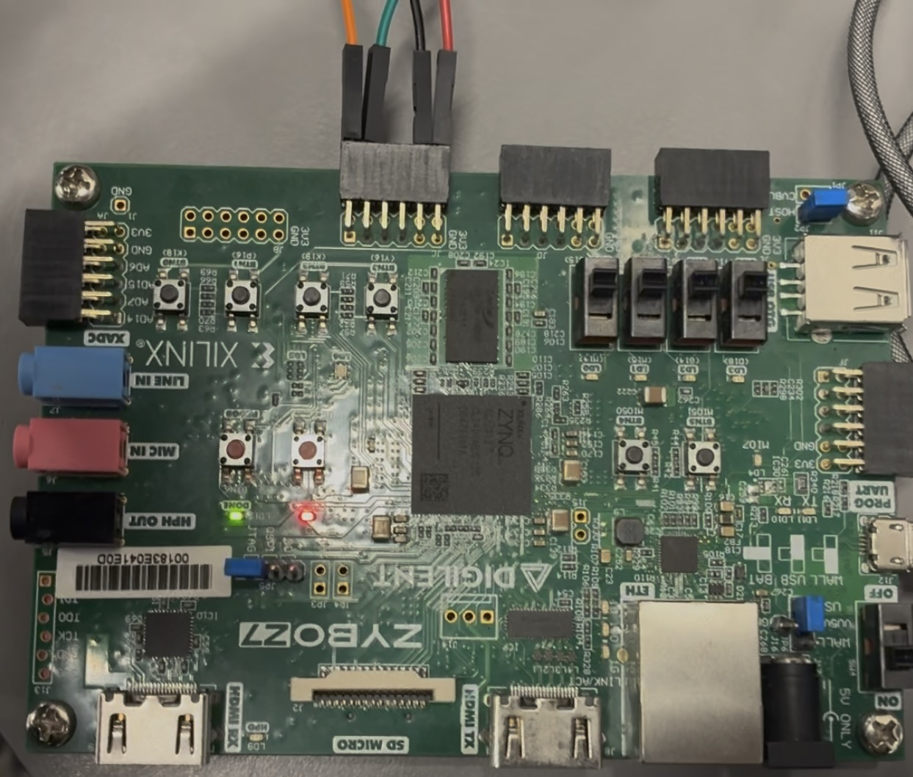

# Laboratorio 01

## FPGA Zybo Z7, Vivado/Vitis y validación de hardware

Segunda práctica de Electrónica Digital II — Universidad Nacional de Colombia, sede Bogotá.

## Integrantes

- Julián David Saavedra Pacheco — jusaavedrap@unal.edu.co
- Juan Sebastián Cortés Gutiérrez — jcortesgu@unal.edu.co
- Carlos Eduardo Matheus Quintero — cmatheus@unal.edu.co

**Grupo de trabajo:** #3 de los miércoles  
**Semestre:** 2026-2

## Índice

- [Introducción](#introducción)
- [Diseño implementado](#diseño-implementado)
- [Simulaciones](#simulaciones)
- [Implementación](#implementación)
- [Evidencias de funcionamiento](#evidencias-de-funcionamiento)
- [Conclusiones](#conclusiones)
- [Referencias](#referencias)

## Introducción

La práctica aborda la implementación de circuitos digitales en la tarjeta **Zybo Z7**. Se desarrollaron dos diseños: un semáforo como smoke test y un test funcional combinacional que procesa dos operandos de cuatro bits mediante operaciones lógicas y aritméticas. El HDL describe su funcionamiento y los archivos XDC establecen la relación entre sus señales y los recursos físicos de la tarjeta.

El test funcional utiliza cuatro switches y cuatro botones integrados, además de dos switches externos montados en una protoboard con resistencias de pulldown. Los resultados se presentan mediante cuatro LEDs verdes y el LED RGB LD6. Cada diseño se programó por JTAG utilizando su bitstream; las evidencias de funcionamiento se presentan en la sección de videos y montaje.

## Diseño implementado

### Actividad 1: smoke test del semáforo

El archivo [`src/semaforo.v`](src/semaforo.v) declara el módulo **`Semaforo`**, con una entrada `clk` y una salida registrada `led[2:0]`. No contiene un registro `state`, una FSM escrita con `case`, entradas de usuario ni reset: la secuencia se obtiene de un contador y un registro de salida.

Hay dos bloques `always @(posedge clk)` que trabajan en paralelo:

1. `counter`, un `integer` de 32 bits inicializado en cero, aumenta en uno; si su valor anterior es mayor o igual a 320 000 000, vuelve a cero.
2. El registro `led` cambia únicamente cuando el valor anterior de `counter` coincide con alguno de los cuatro umbrales. En los demás ciclos conserva su valor. La ausencia de `else` en este bloque secuencial implica retención en flip-flops, no un latch combinacional.

Ambos bloques usan asignaciones no bloqueantes (`<=`). Por eso leen el **mismo contador anterior al flanco**; el bloque de luces no observa de inmediato el incremento o reinicio que programa el otro bloque.

#### Diagrama de flujo



Las dos ramas que salen del flanco representan hardware concurrente. El flujo es una explicación del código; no agrega estados ni altera la lógica.

#### Temporización y fases equivalentes

El XDC declara un periodo de **8 ns**, equivalente a **125 MHz**. Cada intervalo de 80 000 000 ciclos corresponde a `80 000 000 / 125 000 000 = 0,64 s`. La directiva `` `timescale 1ns / 1ps `` define las unidades de simulación, no la frecuencia física.

El contador recorre **0 a 320 000 000 inclusive**. El periodo completo es, por tanto, **320 000 001 ciclos = 2,560000008 s**. El segundo amarillo dura 80 000 001 ciclos: en el flanco que reinicia el contador aún se conserva amarillo y el rojo se registra en el flanco siguiente, al leer cero.



Estos nombres identifican **fases observables**, no estados explícitamente codificados. Los amarillos se distinguen porque uno precede a verde y el otro a rojo.

| Fase actual | Condición del contador anterior en el flanco | Fase siguiente | Duración total de la fase actual |
|---|---|---|---:|
| Rojo | Igual a 80 000 000 | Amarillo 1 | 80 000 000 ciclos |
| Amarillo 1 | Igual a 160 000 000 | Verde | 80 000 000 ciclos |
| Verde | Igual a 240 000 000 | Amarillo 2 | 80 000 000 ciclos |
| Amarillo 2 | Igual a 0 después del reinicio | Rojo | 80 000 001 ciclos |
| Cualquier fase, en la secuencia normal | No se alcanza su umbral de cambio | Conserva la fase | Continúa contando |

#### Tabla de lógica de salida

El vector se escribe en orden **`led[2:0] = {azul, verde, rojo}`**. Un amarillo se obtiene encendiendo rojo y verde a la vez.

| Contador anterior | `led[2:0]` después del flanco | Rojo | Verde | Azul | Color |
|---:|---|---:|---:|---:|---|
| 0 | `001` | 1 | 0 | 0 | Rojo |
| 80 000 000 | `011` | 1 | 1 | 0 | Amarillo |
| 160 000 000 | `010` | 0 | 1 | 0 | Verde |
| 240 000 000 | `011` | 1 | 1 | 0 | Amarillo |
| Cualquier otro | Valor anterior | — | — | — | Conserva el color |

El canal azul permanece apagado durante la secuencia normal. `led` no tiene inicialización explícita: en simulación es `xxx` antes del primer flanco; después recibe rojo. El arranque depende de la inicialización de `counter=0` al configurar la FPGA. No existe un botón de reset en este módulo.

### Actividad 2: test funcional personalizado

El archivo [`src/Test_Funcional.v`](src/Test_Funcional.v) declara **`TestFuncional`**. Su lógica es enteramente combinacional: utiliza asignaciones continuas `assign`, sin reloj ni almacenamiento. Las salidas se actualizan cuando cambian las entradas, una vez transcurridos los retardos de propagación del circuito.

#### Construcción de operandos y selección de operación

```verilog
assign A = SW[3:0];
assign B_temp = BTN[3:0];
assign B = BTN[4] ? ~B_temp : B_temp;
assign resultado = BTN[5] ? (A - B) : (A + B);
```

`A`, `B_temp` y `B` son vectores **sin signo** de cuatro bits, con valores de 0 a 15. `BTN[4]` complementa cada bit de B: numéricamente equivale a `15 - B_temp`. No calcula por sí solo `-B_temp` ni un complemento a dos.

| `BTN[5]` | `BTN[4]` | B efectivo | Operación |
|---:|---:|---|---|
| 0 | 0 | `B_temp` | `A + B_temp` |
| 0 | 1 | `~B_temp` en cuatro bits | `A + (15 - B_temp)` |
| 1 | 0 | `B_temp` | `A - B_temp` |
| 1 | 1 | `~B_temp` en cuatro bits | `A - (15 - B_temp)` |

En este diseño, **BTN4 selecciona el complemento de B y BTN5 selecciona suma o resta**. Aunque pertenecen al bus llamado `BTN`, estas dos señales se controlan con switches externos para mantener cómodamente la configuración de cada prueba.

#### Operaciones lógicas y aritmética

```verilog
assign res_and = A & B;
assign res_or  = A | B;
assign res_xor = A ^ B;
```

Cada operación actúa bit a bit sobre los operandos ya construidos, incluido el complemento opcional de B.

| Aᵢ | Bᵢ | AND | OR | XOR |
|---:|---:|---:|---:|---:|
| 0 | 0 | 0 | 0 | 0 |
| 0 | 1 | 0 | 1 | 1 |
| 1 | 0 | 0 | 1 | 1 |
| 1 | 1 | 1 | 1 | 0 |

`resultado` tiene cinco bits. En esta expresión, el contexto de asignación de cinco bits se propaga a la operación y permite conservar el acarreo de la suma y representar la resta módulo 32.

- **Suma:** el resultado exacto va de 0 a 30; `resultado[4]=1` cuando `A+B>=16`.
- **Resta:** la diferencia matemática va de −15 a 15. Si `A<B`, el vector almacena `32+(A-B)` y su bit 4 vale uno, indicando **préstamo** para estos operandos sin signo.
- **Cuatro LEDs verdes:** `LED=resultado[3:0]` muestra el resultado **módulo 16**. Por ejemplo, `3-5=-2` produce `resultado=11110`, `LED=1110` y rojo encendido. El nibble `1110` se lee como 14 sin signo; no es una representación completa de −2 con indicador de signo separado.

El rojo no es una bandera general de overflow con signo, y los operandos no se interpretan como enteros con signo.

#### Qué indica el LED RGB

Definimos `F=resultado[4]`, `P=|res_and`, `Q=|res_or` y `X=|res_xor`. El operador unario `|` reduce un vector a un bit: vale uno si al menos uno de sus bits vale uno. Por tanto, `|res_xor` indica que los operandos son diferentes; **no calcula paridad**.

```verilog
assign RGB_R = resultado[4];
assign RGB_G = ~resultado[4] & (|res_and);
assign RGB_B = ~resultado[4] & ~(|res_and) & (|res_or) & (|res_xor);
```

| F | P | Q | X | `{R,G,B}` | Interpretación |
|---:|---:|---:|---:|---|---|
| 1 | — | — | — | `100` | Rojo: acarreo de suma o préstamo de resta; prioridad máxima |
| 0 | 1 | — | — | `010` | Verde: existe alguna posición con Aᵢ=Bᵢ=1 |
| 0 | 0 | 1 | 1 | `001` | Azul: operandos sin unos comunes y al menos uno no nulo |
| 0 | 0 | 0 | 0 | `000` | Apagado: ambos operandos efectivos son cero |

`—` significa que ese valor no altera la selección de la fila. Con `P=0`, los casos `Q≠X` no pueden ocurrir para entradas binarias: si no hay unos comunes, `A|B=A^B`. Esta es una tabla de combinaciones alcanzables, no de cuatro variables independientes.

El RGB tiene prioridad **rojo → verde → azul → apagado**. La selección permite identificar una condición a la vez, sin combinar colores. Tampoco indica simplemente si el resultado aritmético es cero: `A=B=5` en resta produce `LED=0000` pero RGB verde.

Las reducciones de AND, OR y XOR se combinan para seleccionar el color. Bajo la condición `P=0`, OR y XOR coinciden, por lo que la síntesis puede simplificar esa parte de la expresión. El RGB indica una relación entre operandos y el resultado aritmético; no representa tres resultados lógicos independientes.

#### Diagrama de flujo del test funcional



Las flechas representan dependencias y decisiones de una red combinacional, no instrucciones ejecutadas en ciclos sucesivos. **No corresponde una tabla de transición de estados** para este módulo porque no tiene memoria. Las tablas de modos, compuertas y salidas describen su comportamiento.

## Simulaciones

Los estímulos se describen en los testbenches de Verilog. Durante la simulación, `$dumpfile` y `$dumpvars` registran las señales en archivos VCD, que se abren en **GTKWave** para observar las entradas, las operaciones internas y las salidas. Las capturas muestran el smoke test de **0 a 120 ns** y el test funcional de **0 a 60 ns**.

### Smoke test del semáforo

El banco [`semaforo_tb.v`](sim/semaforo_tb.v) instancia el módulo `Semaforo` sin modificar el código original de su contador ni sus umbrales. Para probar rápidamente cada fase, utiliza `force uut.counter` y fija temporalmente el valor interno de `counter`, evitando simular los aproximadamente 320 millones de ciclos del contador real.

Primero se fuerza `counter=0` para obtener rojo (`001`); después se aplican 80 000 000 para amarillo (`011`), 160 000 000 para verde (`010`), 240 000 000 para amarillo y, finalmente, cero para regresar a rojo. Cada valor se mantiene durante 20 ns. Así se dejan pasar flancos positivos para que el bloque `always @(posedge clk)` del módulo detecte el valor y actualice `led`.

El reloj del banco cambia cada 5 ns y tiene un periodo de **10 ns**. Sus flancos positivos ocurren a los 5, 15, 25 ns y así sucesivamente; por ello, cada cambio de color aparece 5 ns después de aplicar el nuevo valor forzado. Este reloj de simulación es distinto del periodo de 8 ns utilizado en la tarjeta.

| Intervalo del estímulo | Valor forzado de `counter` | Flanco que actualiza el color | `led[2:0]` | Color |
|---|---:|---:|---|---|
| 0–20 ns | 0 | 5 ns | `001` | Rojo |
| 20–40 ns | 80 000 000 | 25 ns | `011` | Amarillo |
| 40–60 ns | 160 000 000 | 45 ns | `010` | Verde |
| 60–80 ns | 240 000 000 | 65 ns | `011` | Amarillo |
| 80–100 ns | 0 | 85 ns | `001` | Rojo |

A los **100 ns** se ejecuta `release uut.counter`. El contador vuelve a responder a las asignaciones del módulo: alcanza 1 a los 105 ns y 2 a los 115 ns. La salida permanece roja y la simulación termina a los **120 ns**.

#### Evidencia en GTKWave: 0–120 ns



En la captura se observan `clk`, el vector `led[2:0]` y sus tres bits por separado. Antes del primer flanco, `led` aparece como `xxx` porque no tiene inicialización explícita. Después se distingue la secuencia **`001 → 011 → 010 → 011 → 001`**. El canal azul, `led[2]`, permanece en cero una vez establecida la primera salida; el amarillo corresponde a rojo y verde activos simultáneamente.

El archivo [`semaforo.vcd`](sim/semaforo.vcd) también contiene `uut.counter`, aunque esa señal no está desplegada en la captura. Mientras `force` está activo, el contador queda fijado al valor impuesto. Esta prueba permite observar la selección de colores y su actualización en los flancos; no mide las duraciones naturales de 0,64 s ni recorre todo el conteo hasta su reinicio.

### Test funcional

El banco [`Test_Funcional_tb.v`](sim/Test_Funcional_tb.v) aplica cinco combinaciones a `SW` y `BTN`. Las entradas cambian a los **0, 10, 20, 30 y 40 ns**. La última combinación se mantiene hasta que la simulación termina a los **60 ns**; no hay un caso adicional a los 50 ns.

El circuito es combinacional, por lo que no necesita un reloj para actualizar sus salidas. `SW` forma A; `BTN[3:0]` forma B_temp; `BTN[4]` selecciona su complemento y `BTN[5]` selecciona resta cuando vale uno.

| Intervalo | SW = A | `BTN[5:0]` | BTN hexadecimal | B_temp | BTN4 / BTN5 | B efectivo | Operación |
|---|---|---|---|---:|---|---:|---|
| 0–10 ns | `1001` = 9 | `001100` | `0C` | 12 | 0 / 0 | 12 | 9 + 12 = 21 |
| 10–20 ns | `0100` = 4 | `111101` | `3D` | 13 | 1 / 1 | 2 | 4 − 2 = 2 |
| 20–30 ns | `0000` = 0 | `001010` | `0A` | 10 | 0 / 0 | 10 | 0 + 10 = 10 |
| 30–40 ns | `0101` = 5 | `101000` | `28` | 8 | 0 / 1 | 8 | 5 − 8 = −3 |
| 40–60 ns | `0111` = 7 | `000100` | `04` | 4 | 0 / 0 | 4 | 7 + 4 = 11 |

#### Evidencia en GTKWave: 0–60 ns



Los buses de esta captura están representados en **hexadecimal**. Por ejemplo, `resultado=15` significa `0x15=21` en decimal y `resultado=1D` significa `0x1D=29`, que es la representación de −3 módulo 32. Las señales A, B y SW pueden consultarse en el [VCD](sim/TestFuncional.vcd); la imagen muestra BTN, LED, las operaciones lógicas, el resultado y los tres canales RGB.

| Intervalo | `res_and` | `res_or` | `res_xor` | `resultado[4:0]` | `LED[3:0]` | RGB `{R,G,B}` | Color |
|---|---|---|---|---|---|---|---|
| 0–10 ns | `8` | `D` | `5` | `15` | `5` | `100` | Rojo |
| 10–20 ns | `0` | `6` | `6` | `02` | `2` | `001` | Azul |
| 20–30 ns | `0` | `A` | `A` | `0A` | `A` | `001` | Azul |
| 30–40 ns | `0` | `D` | `D` | `1D` | `D` | `100` | Rojo |
| 40–60 ns | `4` | `7` | `3` | `0B` | `B` | `010` | Verde |

Las columnas de operaciones y resultados están en hexadecimal; el vector RGB está en binario. La imagen ordena los canales de arriba hacia abajo como `RGB_B`, `RGB_G`, `RGB_R`.

- **0–10 ns:** la suma 9+12 produce 21. Los cuatro LEDs muestran 5 y el rojo indica acarreo, con prioridad sobre la condición AND no nula.
- **10–20 ns:** B_temp=13 (`1101`) se complementa para obtener B=2 (`0010`). La resta 4−2 produce 2; AND es cero y OR/XOR son no nulos, por lo que se enciende azul.
- **20–30 ns:** la suma 0+10 produce 10. Al no existir unos comunes entre los operandos, se mantiene azul.
- **30–40 ns:** la resta 5−8 produce −3. El resultado de cinco bits es `11101`, los LEDs muestran `1101` y el rojo indica préstamo.
- **40–60 ns:** la suma 7+4 produce 11. AND=4 es distinto de cero y no existe acarreo; se enciende verde.

Esta simulación permite observar suma, resta, complemento de B y la prioridad de los tres colores en las cinco combinaciones aplicadas. No incluye un barrido exhaustivo de entradas ni comprobaciones automáticas con aserciones; la comparación se realiza mediante las formas de onda y los resultados calculados.

### Archivos de simulación

| Diseño | Testbench | Archivo para GTKWave | Simulación compilada |
|---|---|---|---|
| Semáforo | [semaforo_tb.v](sim/semaforo_tb.v) | [semaforo.vcd](sim/semaforo.vcd) | [semaforo_tb.vvp](sim/semaforo_tb.vvp) |
| Test funcional | [Test_Funcional_tb.v](sim/Test_Funcional_tb.v) | [TestFuncional.vcd](sim/TestFuncional.vcd) | [Test_Funcional_tb.vvp](sim/Test_Funcional_tb.vvp) |

Para explorar las señales, abrir el VCD correspondiente en GTKWave y seleccionar el intervalo de la captura. Los archivos `.v` de esta carpeta son bancos de simulación y no se agregan como fuentes de síntesis en Vivado. Los `.vvp` corresponden a Icarus Verilog; GTKWave utiliza los `.vcd`.

## Implementación

### Estructura de la entrega

```text
.
├── README.md
├── .gitignore
├── src/
│   ├── semaforo.v
│   └── Test_Funcional.v
├── constraints/
│   ├── Zybo-Z7.xdc
│   └── pines.xdc
├── sim/
│   ├── semaforo_tb.v
│   ├── semaforo_tb.vvp
│   ├── semaforo.vcd
│   ├── Test_Funcional_tb.v
│   ├── Test_Funcional_tb.vvp
│   ├── TestFuncional.vcd
│   └── img/
└── evidencias/
    ├── montaje/
    ├── smoke-test/
    ├── prueba-1/
    ├── prueba-2/
    └── prueba-3/
```

### Plataforma y recursos de entrada

La Zybo Z7 integra un sistema de procesamiento (**PS**) y lógica programable (**PL**). La ubicación física de un botón no basta para determinar si puede utilizarse como entrada del circuito Verilog. El manual distingue los siguientes recursos:

| Recurso de la placa | Conexión y función |
|---|---|
| BTN0–BTN3 | Entradas de usuario conectadas a la PL; se utilizan en `BTN[3:0]`. |
| BTN4–BTN5 de la placa | Entradas MIO50/MIO51 del PS, accesibles mediante su controlador GPIO y software. No se utilizan como entradas directas de este diseño. |
| PROGB | Borra la configuración de la PL; esta debe volver a programarse mediante el procesador o JTAG. |
| PS-SRST | Reinicia el sistema Zynq, borra la memoria del PS y también limpia la PL, conservando el entorno de depuración. |

Fuente: [manual de referencia de Zybo Z7, secciones 6 y 13](https://digilent.com/reference/_media/reference/programmable-logic/zybo-z7/zybo-z7_rm.pdf).

Los nombres `BTN[4]` y `BTN[5]` del módulo **no identifican los botones MIO de la placa**: son dos entradas de la PL asignadas a JC1 y JC2, controladas por los switches de la protoboard. Los pulsadores de reinicio y borrado tampoco forman parte de los operandos ni de los selectores del test.

### Preparación del diseño y del montaje

La preparación del montaje parte de definir los operandos, los selectores de operación y el significado de cada salida antes de asignar los pines y conectar los componentes. Las tablas de modos y de lógica de salida permiten calcular qué debe observarse para una combinación dada de entradas. Este análisis relaciona el ancho de los vectores, las operaciones bit a bit, las reducciones, el operador condicional y la aritmética con la respuesta física esperada.

La asignación del XDC se realiza a partir de esa interfaz y de los recursos disponibles en la tarjeta. De esta manera, al cargar el bitstream, la prueba consiste en aplicar combinaciones conocidas y comparar los LEDs con los resultados previstos. La simulación complementa esta preparación, mientras que la comprobación sobre la placa permite verificar las conexiones y la respuesta de los componentes reales.

Vivado 2025.2 se utiliza para síntesis, implementación, generación del bitstream y programación JTAG. Ambos circuitos funcionan en la PL y no requieren una aplicación de software para el procesador.

### Tops y proyectos separados

| Proyecto | Archivo Verilog | Top exacto, sensible a mayúsculas | Único XDC activo |
|---|---|---|---|
| Smoke test | `src/semaforo.v` | `Semaforo` | `constraints/Zybo-Z7.xdc` |
| Test funcional | `src/Test_Funcional.v` | `TestFuncional` | `constraints/pines.xdc` |

### Mapeo del smoke test

| Puerto | Pin FPGA | Recurso | Restricción |
|---|---|---|---|
| `clk` | K17 | Reloj del sistema | LVCMOS33, periodo 8 ns |
| `led[0]` | V16 | LD6 rojo | LVCMOS33 |
| `led[1]` | F17 | LD6 verde | LVCMOS33 |
| `led[2]` | M17 | LD6 azul | LVCMOS33 |

El archivo `constraints/Zybo-Z7.xdc` asigna el reloj y los tres canales del RGB a los cuatro puertos del módulo `Semaforo`.

### Mapeo del test funcional

| Puerto | Pin FPGA | Recurso o función |
|---|---|---|
| `SW[0]` | G15 | Switch 0 → A₀ |
| `SW[1]` | P15 | Switch 1 → A₁ |
| `SW[2]` | W13 | Switch 2 → A₂ |
| `SW[3]` | T16 | Switch 3 → A₃ |
| `BTN[0]` | K18 | Botón 0 → B_temp₀ |
| `BTN[1]` | P16 | Botón 1 → B_temp₁ |
| `BTN[2]` | K19 | Botón 2 → B_temp₂ |
| `BTN[3]` | Y16 | Botón 3 → B_temp₃ |
| `BTN[4]` | V15 | Pmod **JC1**, switch externo para invertir B |
| `BTN[5]` | W15 | Pmod **JC2**, switch externo para suma/resta |
| `LED[0]` | M14 | LED verde 0, peso 1 |
| `LED[1]` | M15 | LED verde 1, peso 2 |
| `LED[2]` | G14 | LED verde 2, peso 4 |
| `LED[3]` | D18 | LED verde 3, peso 8 |
| `RGB_R` | V16 | LD6 rojo, acarreo/préstamo |
| `RGB_G` | F17 | LD6 verde, unos comunes sin bandera roja |
| `RGB_B` | M17 | LD6 azul, operandos disjuntos no ambos nulos, sin bandera roja |

Todos los pines se configuran como **LVCMOS33**. El [XDC oficial de Digilent](https://github.com/Digilent/digilent-xdc/blob/master/Zybo-Z7-Master.xdc) identifica V15/W15 como `jc[0]`/`jc[1]`, correspondientes a JC1/JC2.

### Montaje de los switches externos

Se conectó la Zybo Z7 a una protoboard mediante jumpers. En la protoboard se montaron dos switches, cada uno con una resistencia de **pulldown** a tierra. Los switches se eligieron porque permiten cambiar y mantener el modo de operación con mayor facilidad que un pulsador momentáneo, especialmente al combinarlo con los botones que forman B.

| Elemento | Conexión | Función |
|---|---|---|
| Switch de inversión | Nodo de señal → JC1 → V15 → `BTN[4]` | Seleccionar B directo o complementado |
| Switch de operación | Nodo de señal → JC2 → W15 → `BTN[5]` | Seleccionar suma o resta |
| Resistencia de pulldown de cada entrada | Entre su nodo de señal y GND | Mantener cero lógico cuando el switch está abierto |
| Alimentación de los switches | 3,3 V hacia el nodo al cerrar el contacto | Establecer uno lógico |
| Tierra de la protoboard | GND común con la tarjeta | Referencia compartida de las señales |

Con el contacto abierto, el pulldown fija `0`; al cerrarlo, la entrada recibe `1`. Así, el primer switch selecciona `B_temp` o `~B_temp`, y el segundo selecciona suma o resta. La polarización se realiza con resistencias externas; las constraints establecen LVCMOS33 y no añaden un pulldown interno.

#### Fotografías del montaje

**Montaje, parte 1: protoboard con los switches externos y sus resistencias de pulldown.**



**Montaje, parte 2: tarjeta Zybo Z7 y conexión de los jumpers.**



### Síntesis, implementación y programación

1. Abrir Vivado 2025.2 y crear un **RTL Project**. Seleccionar el dispositivo real de la tarjeta.
2. Agregar únicamente el HDL y el XDC del diseño elegido según la tabla de tops. Establecer ese módulo como top y revisar los nombres de `get_ports`.
3. Ejecutar **Run Synthesis**. Revisar mensajes y el esquema sintetizado.
4. Ejecutar **Run Implementation**. Revisar utilización, DRC, asignaciones de pines y temporización. En el semáforo hay un reloj real de 8 ns; en el test combinacional no se define un presupuesto temporal externo, por lo que la ausencia de un requisito de reloj no demuestra cierre temporal a una frecuencia arbitraria.
5. Ejecutar **Generate Bitstream** para obtener el archivo `.bit`.
6. Encender y conectar la Zybo Z7 por JTAG. Abrir **Hardware Manager → Open Target → Auto Connect** y confirmar el dispositivo detectado.
7. Elegir **Program Device** y cargar el `.bit` del diseño correspondiente.
8. Verificar primero la secuencia del smoke test; después cargar el test funcional y contrastar entradas y salidas con las tablas.

Los diseños se programaron por JTAG mediante sus bitstreams. Su funcionamiento sobre la tarjeta se documenta en los videos.

## Evidencias de funcionamiento

### Videos y fotografías del montaje

| Evidencia | Archivo o enlace | Descripción |
|---|---|---|
| Smoke test | [Video del semáforo](evidencias/smoke-test/smoke-test.mp4) | Secuencia de colores del LED RGB |
| Prueba funcional 1 | [Video de la prueba 1](evidencias/prueba-1/primera-prueba.mp4) | Entradas aplicadas y respuesta de los LEDs |
| Prueba funcional 2 | [Video de la prueba 2](evidencias/prueba-2/segunda-prueba.mp4) | Entradas aplicadas y respuesta de los LEDs |
| Prueba funcional 3 | [Video de la prueba 3](evidencias/prueba-3/tercera-prueba.mp4) | Entradas aplicadas y respuesta de los LEDs |
| Montaje | [Parte 1: protoboard](evidencias/montaje/montaje-pt1.png) · [Parte 2: tarjeta](evidencias/montaje/montaje-pt2.jpg) | Jumpers, switches externos y resistencias de pulldown |

### Resultados esperados para combinaciones representativas

Los siguientes resultados se calculan a partir de las ecuaciones del diseño. SW y B_temp están en orden `[3:0]`; el RGB está en orden `{R,G,B}`.

| Caso | A = SW | B_temp | BTN4 | BTN5 | B efectivo | Cálculo | `LED[3:0]` esperado | RGB esperado |
|---|---|---|---:|---:|---|---|---|---|
| Suma con unos comunes | `0011` | `0001` | 0 | 0 | `0001` | 3+1=4 | `0100` | Verde `010` |
| Suma con operandos disjuntos | `0101` | `1010` | 0 | 0 | `1010` | 5+10=15 | `1111` | Azul `001` |
| Suma con acarreo | `1111` | `0001` | 0 | 0 | `0001` | 15+1=16 | `0000` | Rojo `100` |
| Resta sin préstamo | `1001` | `0011` | 0 | 1 | `0011` | 9−3=6 | `0110` | Verde `010` |
| Resta con préstamo | `0011` | `0101` | 0 | 1 | `0101` | 3−5=−2 | `1110` | Rojo `100` |
| Complemento y suma | `0011` | `0001` | 1 | 0 | `1110` | 3+14=17 | `0001` | Rojo `100` |
| Complemento y resta | `0011` | `0001` | 1 | 1 | `1110` | 3−14=−11 | `0101` | Rojo `100` |
| Ambos operandos cero | `0000` | `0000` | 0 | 0 | `0000` | 0+0=0 | `0000` | Apagado `000` |
| Cero aritmético con bits comunes | `0101` | `0101` | 0 | 1 | `0101` | 5−5=0 | `0000` | Verde `010` |

### Efecto individual de las entradas

El siguiente barrido permite relacionar cada entrada con su efecto sobre las salidas. Para los primeros ocho casos se parte de todo en cero y se activa solo la entrada indicada; los controles BTN4 y BTN5 permanecen en cero.

| Entrada que cambia | Configuración tras el cambio | LED esperado | RGB esperado |
|---|---|---|---|
| `SW[0]` | A=1, B=0, suma | `0001` | Azul |
| `SW[1]` | A=2, B=0, suma | `0010` | Azul |
| `SW[2]` | A=4, B=0, suma | `0100` | Azul |
| `SW[3]` | A=8, B=0, suma | `1000` | Azul |
| `BTN[0]` | A=0, B=1, suma | `0001` | Azul |
| `BTN[1]` | A=0, B=2, suma | `0010` | Azul |
| `BTN[2]` | A=0, B=4, suma | `0100` | Azul |
| `BTN[3]` | A=0, B=8, suma | `1000` | Azul |
| `BTN[4]`: 0→1 | A=0, B_temp=0, suma; B cambia 0→15 | `0000`→`1111` | Apagado→azul |
| `BTN[5]`: 0→1 | A=0, B_temp=1, BTN4=0; suma→resta | `0001`→`1111` | Azul→rojo |

La activación individual también permite identificar los cuatro LEDs verdes y el orden de los bits. Los casos de verde, rojo y apagado de la tabla anterior completan la cobertura visual del RGB.

## Conclusiones

- Consultar el manual de referencia es esencial para seleccionar los recursos de la tarjeta. Los botones de usuario de la PL, los botones MIO del PS y los pulsadores de reinicio o borrado tienen funciones diferentes; distinguirlos evita utilizar un control del sistema como si fuera una entrada del circuito. Esta separación explica el uso de dos entradas externas para completar los selectores del test funcional.
- El funcionamiento debe estar definido antes de realizar el montaje y la asignación de pines. Establecer los operandos, los modos de operación y el significado de los LEDs permite construir el XDC y las conexiones a partir de una interfaz conocida. Al cargar el bitstream, la verificación puede centrarse en comparar la respuesta de la FPGA con resultados previamente calculados.
- El uso correcto de Verilog exige comprender tanto las compuertas como las condiciones y los tamaños de las señales. Las operaciones bit a bit, las reducciones y el operador condicional cumplen funciones distintas. En este diseño, su combinación determina la prioridad del RGB; conocer esas relaciones permite anticipar el color que se encenderá y evita interpretar sus canales como resultados independientes.
- Los switches externos facilitaron mantener los modos de inversión y suma/resta durante las pruebas. Las resistencias de pulldown establecen un nivel bajo cuando los contactos están abiertos, mientras que la alimentación de 3,3 V y la tierra común permiten relacionar las posiciones de los switches con niveles lógicos definidos en las entradas.
- El semáforo muestra cómo la frecuencia de reloj y las condiciones de actualización determinan los tiempos observables. Las asignaciones no bloqueantes leen los valores anteriores al flanco, lo que explica el ciclo adicional del segundo amarillo y permite calcular la secuencia a partir del código.
- La aritmética de cinco bits conserva información que no cabe en los cuatro LEDs verdes. Estos muestran el resultado módulo 16, mientras que el canal rojo permite distinguir el acarreo de una suma o el préstamo de una resta. La interpretación depende de la operación seleccionada y del carácter sin signo de los operandos.
- La simulación y la comprobación en la tarjeta se complementan. Los bancos de prueba permiten contrastar las ecuaciones en los casos seleccionados; el montaje físico permite observar la respuesta de los pines, switches y LEDs después de cargar el bitstream. Preparar ambas etapas hace más clara la relación entre el circuito descrito y su comportamiento real.

## Referencias

- J. Velásquez, [Lab01: FPGA (Zybo Z7), Vivado/Vitis y Validación de Hardware](https://github.com/jovelasquezs/2026-2_Lab_Electronica_Digital_2_G3yG4/tree/3e5a3563f740d5e2b09740820cf07ccb5b9a238e/labs/lab01).
- Equipo de trabajo, [repositorio de Lab00](https://github.com/JulianDSPM-a/Lab00_JulianDavidSaavedraPacheco_JuanSebastianCortesGutierrez_CarlosEduardoMatheusQuintero), referencia de organización e integrantes.
- Digilent, [Zybo-Z7-Master.xdc](https://github.com/Digilent/digilent-xdc/blob/master/Zybo-Z7-Master.xdc), referencia oficial de nombres de recursos y pines, consultada el 3 de octubre de 2026.
- Digilent, [Zybo Z7 Reference Manual](https://digilent.com/reference/programmable-logic/zybo-z7/reference-manual), secciones 6 (reinicios), 13 (entradas y salidas) y 16 (Pmod).
- AMD, [Zynq-7000 SoC Technical Reference Manual, UG585](https://docs.amd.com/r/en-US/ug585-zynq-7000-SoC-TRM/Introduction), referencia arquitectónica recomendada por la guía.
